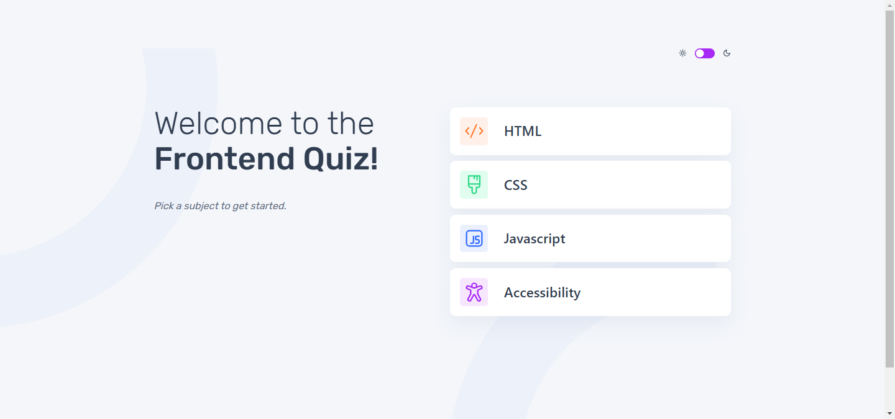

# Frontend Mentor - Frontend quiz app solution

This is a solution to the [Frontend quiz app challenge on Frontend Mentor](https://www.frontendmentor.io/challenges/frontend-quiz-app-BE7xkzXQnU). Frontend Mentor challenges help you improve your coding skills by building realistic projects. This is a [Next.js](https://nextjs.org) project bootstrapped with [`create-next-app`](https://nextjs.org/docs/app/api-reference/cli/create-next-app).

## Table of contents

-   [Overview](#overview)
    -   [The challenge](#the-challenge)
    -   [Screenshot](#screenshot)
    -   [Getting Started](#getting-started)
    -   [Links](#links)
-   [My process](#my-process)
    -   [Built with](#built-with)
    -   [What I learned](#what-i-learned)
    -   [Useful resources](#useful-resources)
-   [Author](#author)

## Overview

### The challenge

Users should be able to:

-   Select a quiz subject
-   Select a single answer from each question from a choice of four
-   See an error message when trying to submit an answer without making a selection
-   See if they have made a correct or incorrect choice when they submit an answer
-   Move on to the next question after seeing the question result
-   See a completed state with the score after the final question
-   Play again to choose another subject
-   View the optimal layout for the interface depending on their device's screen size
-   See hover and focus states for all interactive elements on the page
-   Navigate the entire app only using their keyboard
-   Change the app's theme between light and dark

### Screenshot



## Getting Started

### Local Setup

First, run the development server:

```bash
npm run dev
# or
yarn dev
# or
pnpm dev
# or
bun dev
```

Open [http://localhost:3000](http://localhost:3000) with your browser to see the result.

### Links

-   Live Site URL: [Link](https://frontend-quiz-app-beryl.vercel.app/)

## My process

### Built with

-   Semantic HTML5 markup
-   CSS custom properties
-   Flexbox
-   Mobile-first workflow
-   [React](https://react.dev/) - JS library
-   [Next.js](https://nextjs.org/) - React framework
-   [Chakra UI](https://www.chakra-ui.com/docs/get-started/installation) - For UI components

### Useful resources

-   [Next.js Documentation](https://nextjs.org/docs) - learn about Next.js features and API.
-   [Learn Next.js](https://nextjs.org/learn) - an interactive Next.js tutorial.
-   [Chakra](https://www.chakra-ui.com/docs/styling/overview) - This helped me for styling purposes.
-   [React TypeScript Cheatsheet](https://react-typescript-cheatsheet.netlify.app/) - This is an amazing resource for experienced React developers getting started with TypeScript.
-   [Vercel Platform](https://vercel.com/new?utm_medium=default-template&filter=next.js&utm_source=create-next-app&utm_campaign=create-next-app-readme) - This provides the easiest way to deploy a Next.js app on Vercel

## Author

-   Website - [Habeeb Kareem](https://habeeb-dev.netlify.app)
-   Frontend Mentor - [@olaide-hok](https://www.frontendmentor.io/profile/olaide-hok)
